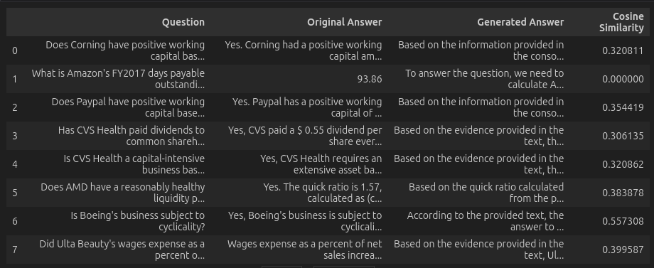

# LLAMA-Finetune-Question-Answering

## Overview

This project has two primary objectives: fine-tuning a Large Language Model (LLM) for question answering and implementing a basic pipeline for Retrieval-Augmented Generation (RAG). Both tasks focus on leveraging financial data to enhance model capabilities in generating accurate and contextually relevant answers.

### Fine-Tuning
The fine-tuning task involves adapting a Large Language Model (LLM) for question answering using financial data. The model is trained to generate precise answers based on provided questions and corresponding context (referred to as `evidence_text` in the dataset).

**All the files are for fine tuning code. You can run 'finetune_main.py' or you can only run finetune.ipynb notebook**

[](finetune.ipynb) **Finetune Notebook**


### Retrieval-Augmented Generation (RAG)
For RAG, we designed a straightforward scenario to demonstrate the pipeline. Although it might not seem practical, it serves as an illustrative example. In this setup, a vector database stores financial documents. A question, along with some context, is posed to the LLM, which generates an answer. This answer is then used to query the vector database, retrieving all financial documents related to the given answer.

**Only one file for RAG task. only run rag.ipynb notebook**

[](rag.ipynb) **RAG Notebook*

## Author
Soumit Das

## Key Components

### Language
- Python

### Key Tool
- Hugging Face
- Chroma (For a Light-weight Vector Database)

### Key Libraries
- `pandas`
- `scikit-learn`
- `PyTorch`
- `transformers`

### Model
**NousResearch/Llama-2-7b-chat-hf**

This model is taken from Hugging Face. It is an open-source, pre-trained Llama-2 model.

### Dataset
- **File:** `syntheses_10.csv`
- **Columns:**
  - `question` (used)
  - `answer` (used, ground truth)
  - `evidence_text` (used)
  - One unnecessary column (ignored)

## Dataset Description
The dataset consists of financial data of various companies, provided in plain text format within the `evidence_text` column. This data is used to generate questions and their corresponding answers. The `answer` column contains the ground truth answers.

## Project Workflow

### Fine-Tuning Workflow

1. **Authentication:**
   - **Login to Hugging Face:**  
     To access Hugging Face resources, authenticate using the following methods:
     - **Command Line Login:**  
       Use `huggingface-cli login` and provide your API key.
     - **Programmatic Login:**  
       Save the Hugging Face API key in a `.env` file:
       ```plaintext
       HF=<your_api_key>
       ```
       Then, in the Python script:
       ```python
       from dotenv import load_dotenv
       import os

       load_dotenv()
       HF_TOKEN = os.getenv("HF")
       login(token=HF_TOKEN)
       ```

2. **Data Preparation:**
   - **Load Dataset:**  
     Use `pandas` to read the `data/syntheses_10.csv` file into a dataframe.
   - **Split Data:**  
     Divide the dataset into:
     - Training set: `train_dataframe`
     - Testing set: `test_dataframe`

3. **Prompt Preparation:**  
     - Generate training prompts using the `question`, `evidence_text`, and `answer` columns from `train_dataframe` and a `prompt_template`.
     - Create validation prompts similarly.
     - Prepare test prompts without including the ground-truth `answer`.

4. **Model Preparation:**
   - **Load Pre-trained Model:**  
     Download the publicly available LLaMA-2 model (in quantized form) and its corresponding tokenizer from Hugging Face.
   - **Quantization:**  
     Apply quantization using `BitsAndBytesConfig`. Quantization reduces model size and computational requirements, enabling faster inference and efficient use of memory without significant performance loss:
     ```python
     bnb_config = BitsAndBytesConfig(
         load_in_4bit=load_in_4bit,  # Load model in 4-bit precision
         bnb_4bit_use_double_quant=bnb_4bit_use_double_quant,  # Use double quantization
         bnb_4bit_quant_type=bnb_4bit_quant_type,  # Quantization type (e.g., "nf4")
         bnb_4bit_compute_dtype=bnb_4bit_compute_dtype  # Compute dtype (e.g., torch.bfloat16)
     )
     ```
     ```python
     def get_model(model_path: str,
              bnb_config: BitsAndBytesConfig,
              device:str):
              
              model = AutoModelForCausalLM.from_pretrained(model_path,
                                                 quantization_config=bnb_config,
                                                 device_map = "auto")
              return model
     ```

### 5. Fine-Tuning

#### Fine-Tune Using LoRA:
- **LoRA Configuration:**  
  In this step, LoRA (Low-Rank Adaptation) is used to efficiently fine-tune the pre-trained model with minimal additional parameters. LoRA adds low-rank matrices to the model’s weight matrices, reducing the number of parameters and enabling faster and more memory-efficient fine-tuning. This approach is particularly beneficial when training large models with limited computational resources.

    ```python
    def get_lora_config(r: int = 16,
                        lora_alpha: int = 64,
                        target_modules: list[str] = ["q_proj", "k_proj", "v_proj", "o_proj"],
                        lora_dropout: float = 0.1,
                        bias: str = "none",
                        task_type: str = "CAUSAL_LM"
                        ) -> LoraConfig:
        lora_config = LoraConfig(
            r=r,# The rank of the low-rank decomposition
            lora_alpha=lora_alpha,# Scaling factor for the low-rank matrix
            target_modules=target_modules,# Target modules (e.g., LLaMA-specific layers)
            lora_dropout=lora_dropout,# Dropout rate for the low-rank layers
            bias=bias,# Bias term ("none", "all", or "lora_only")
            task_type=task_type # Task type (e.g., "CAUSAL_LM")
        )
        return lora_config
    ```
  
- **LoRA Integration with the Model:**  
  Apply LoRA to the pre-trained LLaMA-2 model by integrating the LoRA layers into the model. The LoRA layers are added in such a way that they can be fine-tuned independently, while the base model weights remain fixed, providing a memory-efficient fine-tuning solution.

    ```python
    def apply_lora(model,lora_config):
        model.gradient_checkpointing_enable()
        model = prepare_model_for_kbit_training(model)
        model = get_peft_model(model, lora_config)
        return model
    ```

### 6. Model Training

- **Training Setup:**  
  After configuring LoRA, the next step is to prepare the model for training. This involves setting up the hyperparameters. The fine-tuning process will use the training prompts prepared earlier, where each prompt is associated with a corresponding answer.
  
- **Training the Model:**  
  The model is then trained using the fine-tuned setup, where the LoRA layers are optimized along with the associated training data. The training will be performed using the training set created earlier, with the aim of improving the model’s ability to generate relevant answers based on the given prompts.

- **Saving the Fine-Tuned Model:**  
  After the fine-tuning process, the trained model is saved locally in the directory `data/model/Fine_Tuned_LLaMA2` for later use during testing and evaluation.

### 7. Testing

- **Load Fine-Tuned Model:**  
  To evaluate the fine-tuned model, it needs to be loaded back from local storage. This is done by loading the model and tokenizer in quantized form, ensuring that the model's size and computational requirements remain minimal while maintaining performance.

- **Generate Predictions:**  
  The previously prepared test prompts are used to generate answers from the fine-tuned model. For each test prompt, the model will generate a predicted answer, which can then be compared to the ground-truth answer from the dataset.

### 8. Evaluation

- **Cosine Similarity Metric:**  
  To assess the quality of the generated answers, cosine similarity is used as the evaluation metric. Cosine similarity calculates the similarity between the generated answer and the ground-truth answer by measuring the angle between their vector representations. Higher cosine similarity indicates a more accurate and relevant answer.

- **Evaluation Process:**  
  For each generated answer, the cosine similarity score is calculated by comparing the model's output with the original answer from the dataset.
  


---

### RAG Workflow

1. **Setup Vector Database:**
   - Store financial documents in a ChromaDB vector database, enabling efficient retrieval.

2. **Input and Retrieval:**
   - Provide a financial question along with some initial context to the fine-tuned LLM.
   - Use the generated answer to query the vector database.

3. **Document Retrieval:**
   - Retrieve relevant financial documents from the vector database based on the query generated by the LLM.

4. **Demonstration:**
   - This pipeline is designed to showcase the Retrieval-Augmented Generation (RAG) methodology, emphasizing its ability to connect model outputs with relevant documents.

---

### ChromaDB Integration

- ChromaDB is used as the vector database in this pipeline.
- A collection is created to store financial documents.
- When a financial question is posed, the LLM generates an answer, which is then used to query the vector database.
- Based on the query, relevant financial documents are retrieved from the vector database.

